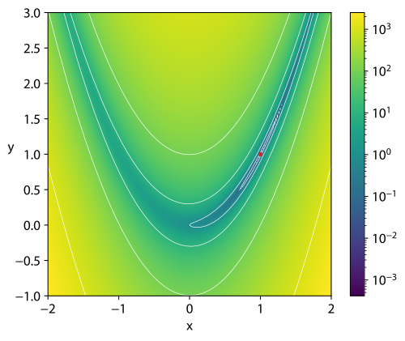
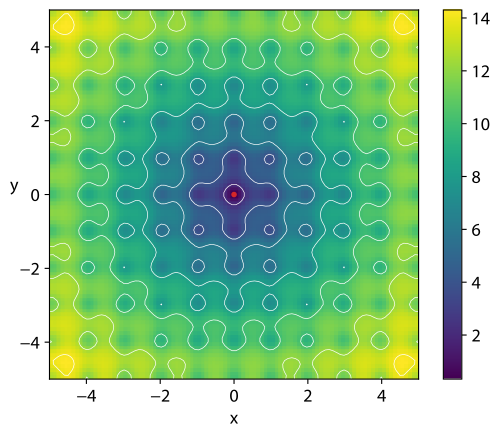
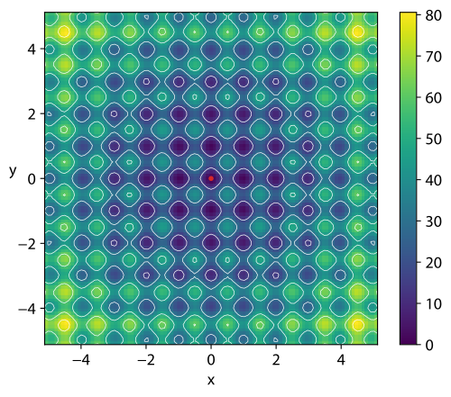

## Problem statement

We consider the classical unconstrained non-linear optimization problem

$$
\min_{x \in \mathbb{R}^n} f(x),
$$

where $f : \mathbb{R}^n \to \mathbb{R}$ is assumed to be sufficiently smooth (typically at least twice continuously differentiable).
A standard second-order method for this problem is **Newton’s method**, whose iteration can be written as

$$
H_k \Delta_k = -\nabla f(x_k), \quad x_{k+1} = x_k + \Delta_k,
$$

where $H_k$ is the Hessian of $f$ at $x_k$ and $\nabla f(x_k)$ is the gradient. Newton’s method can achieve quadratic convergence near the solution but it has some drawbacks:

- computing and storing the full Hessian $H_k \in \mathbb{R}^{n \times n}$ is expensive for large $n$;
- solving a linear system with $H_k$ at each iteration is also costly;
- global convergence typically requires safeguards, such as **line-search** or **trust-region** strategies.

For moderately large or large-scale problems, forming and storing the full Hessian quickly becomes prohibitive, and more efficient approaches are required. **Quasi-Newton methods** address this by building and updating an approximation of the Hessian (or its inverse) using only gradient information, while still retaining superlinear convergence under suitable conditions.

This project focuses on two such methods: **BFGS** and **L-BFGS**.

---

## Algorithms

This project implements/analyzes Quasi-Newton methods for unconstrained non-linear optimization.

### BFGS (Broyden–Fletcher–Goldfarb–Shanno)

BFGS is an iterative method for solving unconstrained non-linear optimization problems. As a Quasi-Newton method, it approximates the Hessian matrix of the objective function using gradient evaluations.

- **Mechanism:** It maintains a full dense approximation of the (inverse) Hessian matrix and updates it at each step so that the **secant equation** is satisfied. The search direction is obtained by solving a linear system involving this matrix.
- **Performance:** It offers superlinear convergence under standard assumptions and is generally robust in practice.
- **Memory cost:** $O(n^2)$, where $n$ is the number of variables. This makes it suitable for small to medium-sized problems, where storing an $n \times n$ matrix is still feasible.

### L-BFGS (Limited-memory BFGS)

L-BFGS is an optimization algorithm in the family of Quasi-Newton methods that approximates the BFGS algorithm using a limited amount of memory.

- **Mechanism:** Instead of storing the full $n \times n$ inverse Hessian matrix, it stores only a small number of vector pairs $(s_k, y_k)$ that implicitly represent the quasi-Newton approximation. It maintains a history of the past $m$ updates (where $m$ is typically small, e.g., 5–20) and uses the **two-loop recursion** to apply the inverse Hessian approximation to a vector.
- **Performance:** It enjoys similar convergence properties to full BFGS in many cases, though it can be slightly less robust on very ill-conditioned problems.
- **Memory cost:** $O(mn)$, which makes it well suited for large-scale problems with thousands or millions of variables, as the memory footprint grows only linearly with the problem dimension.

---

### Organization of the code

The directory structure is as follows:

```text
./Project
  ├── build/
  ├── lib/
  ├── paper/
  └── src/
```

- `build` contains the output of CMAKE
- `lib` contains the external libraries
- `paper`containes the academic literature provided
- `src` contains all the C++ code to be compiled

### Compiling

To compile we use CMAKE, from the `Project` directory run:

```zsh
mkdir build
cd build
cmake ..
make
```
#### Run
To run the test from the `build` directory:
```zsh
./test
```

### Documentation

The full API documentation generated with Doxygen is available here:

👉 [**Open the documentation**](https://amsc-25-26.github.io/lfbgs-1-lbfgs/)

### Tests

The test suite evaluates the performance of BFGS, L-BFGS, Newton's method, and a hybrid BFGS+GMRES variant on three benchmark optimization problems:

#### 1. **Rosenbrock Function**



The Rosenbrock function is a classic test problem for optimization algorithms. It features a long, narrow parabolic valley that makes it challenging for algorithms to navigate efficiently.

**Characteristics:**
- Non-convex function with a global minimum at $(1, 1, \ldots, 1)$
- Dimension tested: $n = 4$
- Convergence criterion: gradient norm $\leq 10^{-10}$
- Tolerance: $10^{-12}$, max iterations: $4000$

---

#### 2. **Ackley Function**



The Ackley function is a highly multimodal landscape with a single global minimum. It tests the algorithm's ability to explore and avoid being trapped in local minima.

**Characteristics:**
- Multimodal function with global minimum at the origin $(0, 0, \ldots, 0)$
- Dimension tested: $n = 3$
- Convergence criterion: gradient norm $\leq 10^{-9}$
- Tolerance: $10^{-10}$, max iterations: $4000$

---

#### 3. **Rastrigin Function**



The Rastrigin function is highly oscillatory with many local minima, providing a severe test of robustness and global convergence capabilities.

**Characteristics:**
- Highly multimodal landscape with global minimum at the origin $(0, 0, \ldots, 0)$
- Dimension tested: $n = 500$ (large-scale problem)
- Convergence criterion: gradient norm $\leq 10^{-8}$
- Tolerance: $10^{-9}$, max iterations: $5000$
- This test demonstrates the scalability of L-BFGS and memory efficiency of the algorithms

---

#### Test Implementation

All tests are implemented in [tests/main.cpp](tests/main.cpp) and use a flexible test suite framework that allows comparing multiple solver implementations side-by-side on the same benchmark problems. The solvers are evaluated based on:

- **Convergence:** Whether the gradient norm reaches the specified tolerance
- **Solution accuracy:** How close the found solution is to the known global minimum
- **Iteration count:** Number of iterations required to converge
- **Memory efficiency:** Particularly important for the Rastrigin function test

---

#### Performance Results

The table below summarizes the performance of the four solvers across the three benchmark functions:

| Function | Solver | Time (μs) | Iterations | Tolerance |
|----------|--------|-----------|-----------|-----------|
| **Rosenbrock** | BFGS | 2,728 | 52 | $10^{-12}$ |
| | BFGS + GMRES | 6,342 | 52 | $10^{-12}$ |
| | L-BFGS | **1,295** | 47 | $10^{-12}$ |
| | Newton | 18,024 | 395 | $10^{-12}$ |
| **Ackley** | BFGS | 342 | 7 | $10^{-10}$ |
| | BFGS + GMRES | 644 | 7 | $10^{-10}$ |
| | L-BFGS | **80** | 5 | $10^{-10}$ |
| | Newton | 102 | 3 | $10^{-10}$ |
| **Rastrigin** | BFGS | 251,197 | 1 | $10^{-9}$ |
| | BFGS + GMRES | **45,107** | 1 | $10^{-9}$ |
| | L-BFGS | **12,260** | 1 | $10^{-9}$ |
| | Newton | 647,068 | 3 | $10^{-9}$ |

**Key Observations:**

- **L-BFGS excels on Rosenbrock and Ackley functions**, being the fastest across these smooth, well-conditioned problems.
- **BFGS + GMRES is competitive on the large-scale Rastrigin problem** ($n=500$), where the iterative solver avoids dense linear system solves.
- **Newton's method struggles on Rastrigin**, requiring many iterations due to the oscillatory landscape and the cost of Hessian computations at each step.
- **L-BFGS demonstrates superior scalability** on the large-scale Rastrigin test, where memory efficiency becomes critical.
